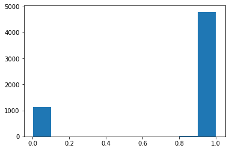

# Convolutional_Neural_Network_Classifier
For training the CNN peroxisome model, we utilized Pex13 mutant cells, which expressed GFP-Cat signals throughout their cytoplasm. 

The Classification diverged into three parts:
1) Set training data
2) Model Generation
3) Evaluation

<center><b><u>Set training data</u></b></center>

The GFP-Cat images were then segmented into individual cells and saved into two separate folders - one for phenotypic images and another for normal peroxisomes.

```python
from AIPyS import AIPS_cellpose as AC
```
For example, we used the CellPose model for segmenting the images (as described in section 2):
```python
AIPS_pose_object = AC.AIPS_cellpose(Image_name = 'catGFP.tif', path = 'data', model_type = 'cyto', channels=[0,0])
img = AIPS_pose_object.cellpose_image_load()
```

The function ```stackObjects_cellpose_ebimage_parametrs_method``` similar to the R packadge EBimage (publish by Pau et. al. ) brekes the mask input into 150 pixel single-cell images. 

```python
AIPS_pose_object = AC.stackObjects_cellpose_ebimage_parametrs_method(Image_name = 'catGFP.tif', path = 'data',                                                                          model_type = 'cyto', channels=[0,0])
img = AIPS_pose_object.cellpose_image_load()
mask, table = AIPS_pose_object.cellpose_segmantation(image_input=img[0,:,:])

##### Than EBimage like stacking function is used

stack, _ = AIPS_pose_object.stackObjects_cellpose_ebimage_parametrs_method(image_input=img[0, :, :],
                                                                           extract_pixel=50,
                                                                           resize_pixel=150,
                                                                           img_label=table.index.values[i])


```

- Pau G, Fuchs F, Sklyar O, Boutros M, Huber W (2010). “EBImage—an R package for image processing with applications to cellular phenotypes.” Bioinformatics, 26(7), 979–981. doi: 10.1093/bioinformatics/btq046.


The single-cell images are to be organized into a training structure consisting of three separate directories, training_data, validation_data and test_data, each containing two folders; one for positive samples (pheno) and one for negative samples (norm). The data is then ready to be used for machine learning model training and validation.

```python
from AIPyS import Taining_data_orgenizer as orgenizer 


pathInput = '/input_sc_mix'
pathOrigen = '/data/training_set'
labelA = 'norm'
labelB = 'pheno'
file_extention = 'png'


path_builder = orgenizer.classification_data_orgenizer(path_input = pathInput,
                                                       path_origen = pathOrigen,
                                                       label_A=labelA,
                                                       label_B =labelB,
                                                       file_extention =file_extention)

path_builder.get_file_names_list()

statment_a, statment_b, train_files, validate_files, test_files = path_builder.split_traning_set_and_copy()

```

Directory structure:

```
training_set
│
└───training_data
|       │phno01.png
│       │norm01.png
│       │...
│   
└───validation_data
|       │pheno02.png
│       │norm02.png
│       │...
└───test_data
        │pheno03.png
        │norm03.pn
        │...
```


<center><b><u>Model Generation</u></b></center>

The plotform contain four CNN models. 
- Basic CNN model
- Basic CNN model with data Augmentation
- Transfer learning drop layer 4 and 5
- Transfer learning with Augmentation freez all layer

```python
from AIPyS import model_builder as mb
```

We set hyperparamters for the model

```python
train_dir = os.path.join(path_origen, 'training_data')
val_dir = os.path.join(path_origen, 'validation_data')
test_dir = os.path.join(path_origen, 'test_data')
batch  = 30
epoch  = 50
step_per_epoch = int((9930)/30)
validation_steps = int((1242)/30)
path_model = '/data/models'
IMG_DIM=(150,150,3)
imbalance_train = 921
imbalance_val = 115
model_name = '10precent.h5'
path_checkpoints = '/data/models/chakpoints_10p/'
```

Intiate model bulider:

```python
model_build = mb.model_builder(IMG_DIM=(150,150,3),path_training=train_dir,path_validation=val_dir,
                 batch=batch, epoch = epoch,input_shape = (150,150,3) ,steps_per_epoch_sel= step_per_epoch,
                 validation_steps=validation_steps,path_model = path_model,file_extention = 'png',
                 extract_size_train = extract_size_train, extract_size_val=extract_size_val)
```

Image files are loaded and converted to tf tensor.

```python
TRimgScale,ValimgScale,TRlabels,Valabels,TRimg,Valimg,report = model_build.build_image__sets()
print report
```
tarin labels:['norm', 'pheno', 'norm', 'norm', 'norm'], train_labels_enc:[0 1 0 0 0].


Train models:

```python
cnn_basic = model_build.model_cnn_basic()
cnn_basic_Augmentation = model_build.model_cnn_basic_Augmentation()
cnn_transfer_learning_Augmentation_drop_layer_4and5  =           model_build.model_cnn_transfer_learning_Augmentation_drop_layer_4and5()
transfer_learning_aug_dropout_freez_all = model_build.model_cnn_transfer_learning_Augmentation_freez_all()
```


<center><b><u>Evaluation</u></b></center>

Assess the efficacy of the model constructed by assessing its performance.
First, the test files will be converted into tensors of model input pixel size.   
```python
test_imgs = [img_to_array(load_img(img, target_size=IMG_DIM)) for img in test_files]
test_imgs = np.array(test_imgs)
test_imgs_scaled = test_imgs.astype('float32')
test_imgs_scaled /= 255
```
The labels are assigned an integer value to be encoded.  
```python
test_labels = [fn.split('/')[1].split('_')[0].strip() for fn in test_files]
num2class_label_transformer = lambda l: ['norm' if x[0] == 0 else 'pheno' for x in l]
class2num_label_transformer = lambda l: [0 if x == 'pheno' else 1 for x in l]
test_labels_enc = class2num_label_transformer(test_labels[:5])

print('Test dataset shape:{}'.format(test_imgs.shape))
print(test_labels[0:5], test_labels_enc[0:5])
```

```

    Test dataset shape:(5967, 150, 150, 3)
    ['norm', 'pheno', 'norm', 'pheno', 'norm'] [1, 0, 1, 0, 1]


```python
predictions = cnn_transfer_learning_Augmentation_drop_layer_4and5.predict(test_imgs_scaled, verbose=0)
plt.hist(predictions)
```


    


```python
classes_x=[np.where(lab >0.5,1,0).tolist() for lab in predictions]
predictions_label = num2class_label_transformer(classes_x)
predictions_label
meu.get_metrics(test_labels, predictions_label)
```


